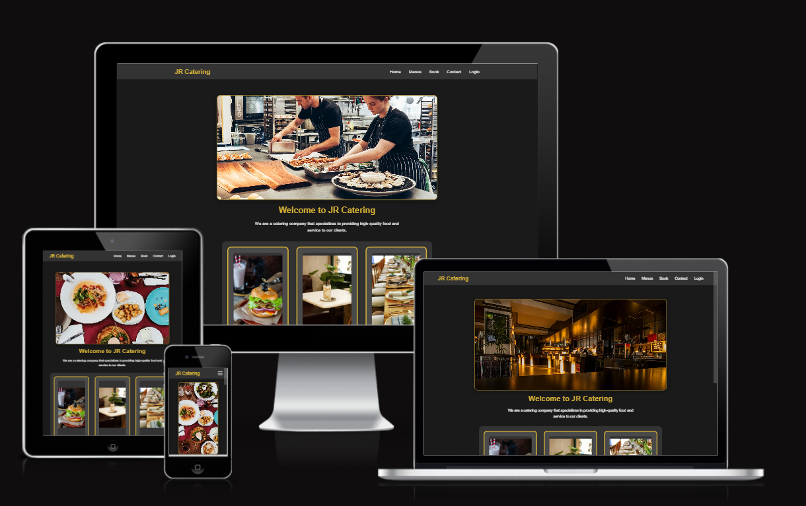
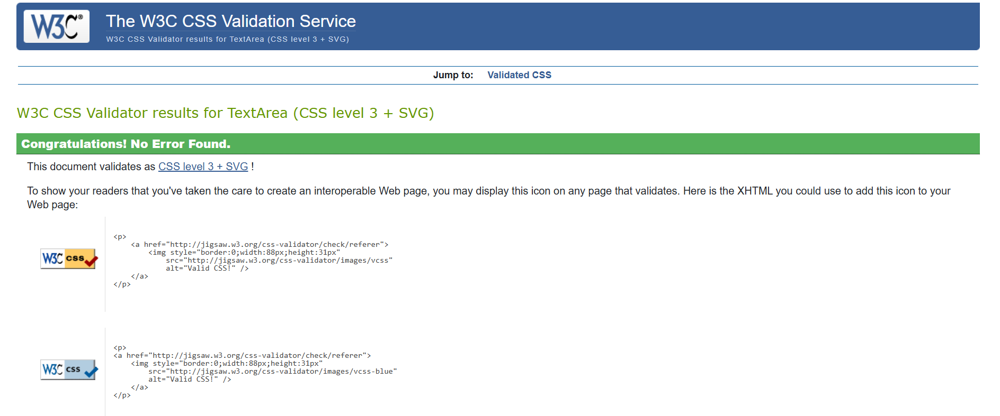

# JR Catering Website

## Description
A full-stack restaurant booking and catering management system that allows users to create accounts, make reservations, and manage their bookings. The website also provides information about the catering services, menu options, and contact details.

## Table of Contents

1. [Description](#description)
2. [Features](#features)
   - [Homepage](#homepage)
   - [Menu Page](#menu-page)
   - [Booking System](#booking-system)
   - [User Authentication](#user-authentication)
   - [Contact Page](#contact-page)
   - [Admin Dashboard](#admin-dashboard)

3. [Technologies Used](#technologies-used)
   - [Frontend](#frontend)
   - [Backend](#backend)
   - [Deployment](#deployment)

4. [Installation & Setup](#installation--setup)
   - [Local Development](#local-development)
   - [Environment Variables](#environment-variables)
   - [Database Setup](#database-setup)

5. [Deployment](#deployment)
   - [Heroku Deployment](#heroku-deployment)
   - [Local Deployment](#local-deployment)
   - [Dependencies](#dependencies)

6. [Testing](#testing)
   - [Manual Testing](#manual-testing)
   - [Automated Testing](#automated-testing)
   - [Validation](#validation)

7. [Credits](#credits)
   - [Content](#content)
   - [Media](#media)
   - [Acknowledgments](#acknowledgments)

8. [Future Features](#future-features)

9. [Contact](#contact)

## Features
  - User Authentication (Register/Login)
  - Booking Management System
  - Create new bookings
  - Edit existing bookings
  - Cancel bookings  
  - View booking history
  - Real-time Booking Updates
  - Contact Form with Email Integration
  - Interactive Menu Display
  - Responsive Design for Mobile and Desktop
  - Admin Dashboard for Booking Management
  - View all bookings
  - Manage user accounts
  - Handle booking requests
  - Update menu items

### Homepage
The homepage welcomes users with:
- Clean, modern design
- Navigation menu for easy access to all sections
- Featured menu items
- About us section
- Call-to-action buttons for booking and contact
- Responsive design that works on all

### Booking System
Comprehensive booking management:
- User-friendly booking form
- Date and time selection
- Guest number specification
- Special requests field
- Real-time availability checking
- View existing bookings
- Edit booking functionality
- Cancel booking option
- Booking history

### User Authentication
Secure user account management:
- User registration
- Login system
- Password reset functionality
- Personal information storage
- Session management
- Security features

### Contact Page
Interactive contact features:
- Contact form with email integration
- Business hours display
- Location information
- Google Maps integration
- Phone and email contact options
- Social media links
- Direct messaging system

### Menu Page
Interactive menu display featuring:
- Categorized food sections
- Detailed descriptions of each dish
- Pricing information
- Special dietary indicators (Vegetarian, Vegan, Gluten-Free)
- High-quality food images
- Daily specials section

## Technologies Used- 
- Frontend:
  - HTML5
  - CSS3
  - JavaScript
  - Bootstrap 

- Backend:
  - Python
  - Flask Framework
  - SQLAlchemy
  - SQLite Database

- Deployment:
  - Heroku 

## Installation & Setup
1. Clone the repository
2. Create a virtual environment
3. Install the required dependencies
4. Set up the database
5. Run the application


## Deployment

### Heroku Deployment
The site was deployed to Heroku. The steps to deploy are as follows:

1. Create a new Heroku app:
   - Log in to Heroku
   - Click "New" from the dashboard
   - Select "Create new app"
   - Enter a unique app name
   - Choose your region (EU or USA)
   - Click "Create app"

2. Set up environment variables:
   - From your app dashboard, click on "Settings"
   - Click "Reveal Config Vars"
   - Add the following config vars:
     - `SECRET_KEY`: Your secret key
     - `DATABASE_URL`: Your database URL
     - `CLOUDINARY_URL`: Your Cloudinary URL (if using Cloudinary)
     - `PORT`: 8000

3. Prepare the application:
   - In your GitHub repository, create a `requirements.txt`:
     ```
     pip freeze > requirements.txt
     ```
   - Create a `Procfile` in the root directory:
     ```
     web: gunicorn app:app
     ```

4. Connect to GitHub:
   - Go to the "Deploy" tab in your Heroku dashboard
   - Select "GitHub" as the deployment method
   - Connect to your GitHub repository
   - Choose the branch you want to deploy

5. Deploy:
   - Choose "Enable Automatic Deploys" for automatic deployment when you push to GitHub
   - Click "Deploy Branch" for manual deployment


## Usage
### User Features
- Register for an account or log in
- Navigate to the booking section to make a reservation
- View and manage your bookings in the bookings dashboard
- Use the contact form for inquiries
- Browse the menu and services offered

### Admin Features
- View all user bookings and manage them
- Update menu items and availability
- Handle user inquiries
- View booking statistics

## Testing
### Manual Testing
- User Authentication
- Registration
- Login
- Password Reset
- Booking System
- Creating Bookings
- Editing Bookings
- Cancelling Bookings
- Contact Form
- Responsive Design
- Admin Functions

### CSS
- W3C Validator



## Future Features
- Online payment integration
- SMS notifications
- Table layout visualization
- Customer review system

## Credits
- Mentor: [Mo Shami]
- Code Institute
